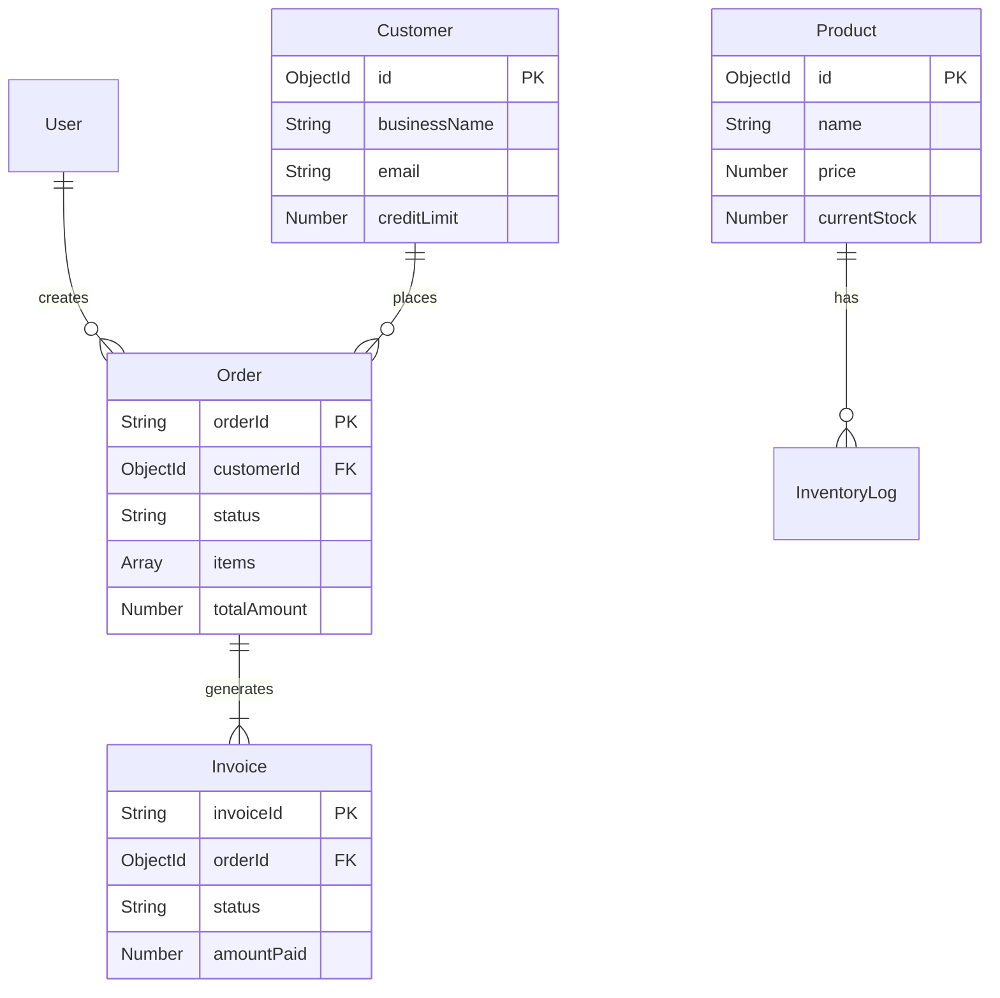
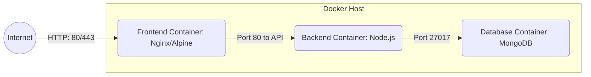

# Design Architecture Proposal: GreenBasket DMS

## 1. System Overview
The GreenBasket Distribution Management System (DMS) is designed as a decoupled, full-stack web application relying on a modern JavaScript-based architecture. The decoupling of the Frontend and Backend ensures independent scalability and eases the integration of future mobile applications.

## 2. High-Level Architecture
Below is the high-level context diagram representing the interactions between different users and the system components.

```mermaid
graph TD
    %% User Roles
    Director[Operations Director] --> |Analytics & Users| UI(Frontend SPA: React)
    Sales[Sales Staff] --> |Manage Orders| UI
    Warehouse[Warehouse Staff] --> |Manage Stock & Packing| UI
    Driver[Delivery Driver] --> |Update Delivery| UI
    Customer[Customer] --> |Place Orders| UI
    Accountant[Accounting] --> |Manage Invoices| UI

    %% System Components
    UI -- "REST APIs (JSON/JWT)" --> API(Backend API: Node/Express)
    API -- "Mongoose ODM" --> DB[(Database: MongoDB)]
    
    %% External Integration
    API -.-> |Export Data (XML/CSV)| Tally[Tally Accounting Software]
```

## 3. Component Architecture

### 3.1 Frontend Architecture
The Frontend is a Single Page Application (SPA) built with React.js and compiled via Vite for optimal development and build speeds.
- **Routing:** Handled entirely on the client side using `react-router-dom`, protecting routes based on JWT payload roles.
- **State Management:** Core state (e.g., Auth, Theme) is managed via React Context API. Component-level state is handled using React Hooks (`useState`, `useReducer`).
- **Data Fetching:** Axios is utilized with request/response interceptors to attach bearer tokens automatically and handle unauthorized (`401`) errors gracefully.
- **Data Visualization:** `recharts` is integrated to provide dynamic and responsive dashboards.

### 3.2 Backend Architecture
The Backend is a Node.js RESTful API serving JSON payloads over HTTP.
- **Web Framework:** Express.js provides route handling and middleware management.
- **Security Middleware:** CORS is configured to allow frontend communication. Incoming requests are authenticated via custom JWT middleware validating tokens.
- **Role-Based Access Control (RBAC):** Custom middleware intercepts requests to sensitive endpoints, ensuring the decoded JWT contains the necessary user `role` (e.g., `isDirector`, `isWarehouse`).
- **Data Validation:** Ensures data integrity before hitting the database.

## 4. Database Schema
MongoDB provides a flexible, document-oriented schema design perfectly suited for evolving business models.



## 5. Security & Authentication Design
- **Authentication:** Stateless authentication using JSON Web Tokens (JWT). Upon successful login, the API issues a signed JWT containing the user's ID and Role.
- **Password Hashing:** `bcryptjs` is used to cryptographically salt and hash all user passwords before storage. Plaintext passwords are never stored.
- **Authorization:** API routes are logically grouped. For example, `PUT /api/orders/:id/deliver` validates that the user is a `Delivery Driver` or `Director`.

## 6. API Design Principles
The system adheres to standard RESTful conventions:
- **Nouns vs. Verbs:** Endpoints use nouns (e.g., `/api/orders`, `/api/products`). Verbs are represented by HTTP methods (GET, POST, PUT, DELETE).
- **Custom Actions:** For specific workflows, custom actions are appended (e.g., `/api/orders/:id/process`, `/api/orders/:id/assign-driver`).
- **Response Format:** All responses follow a standard JSON envelope to ensure predictable parsing on the client side.

## 7. Deployment Strategy
The system is containerized to ensure consistency across development, staging, and production environments.


- **docker-compose:** Used to orchestrate the multi-container environment, managing network bridges and persistent volumes for MongoDB data.
- **Environment Variables:** Secrets (like `JWT_SECRET`, `MONGODB_URI`) are injected at runtime via `.env` files, keeping them out of source control.

---
**Status:** Architecture Finalized and Implemented.
